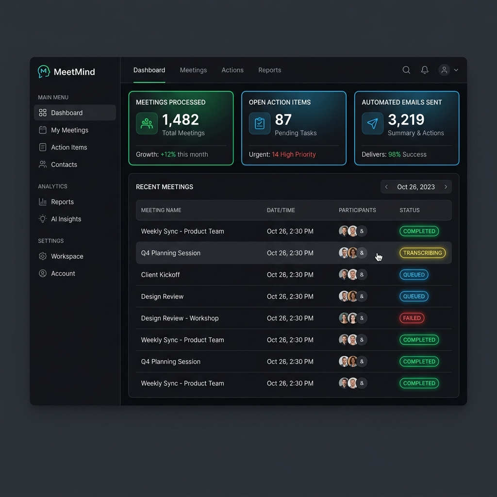
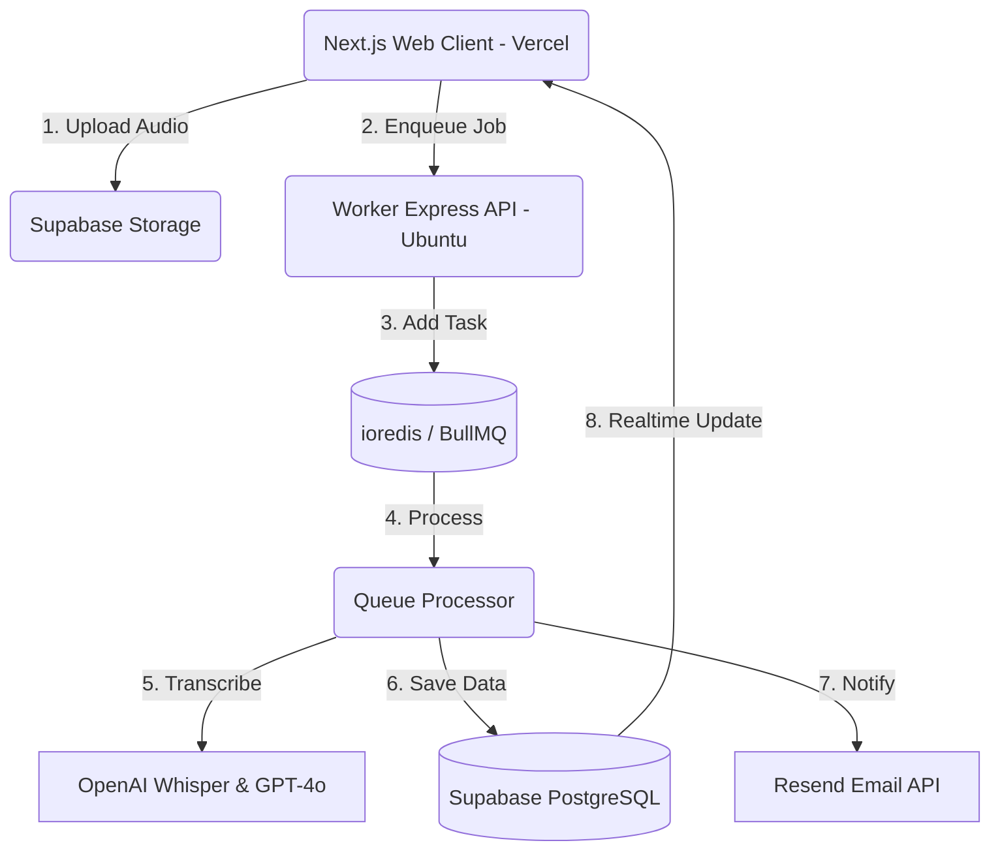

# 🧠 MeetMind — AI Meeting Notes & Action Tracker

<p align="center">
  
</p>

MeetMind, toplantı kayıtlarınızı (ses/video) saniyeler içinde yazıya döken, ana kararları özetleyen, görevleri (aksiyon maddelerini) ilgili kişilere atayan ve katılımcılara otomatik takip e-postası gönderen **bütünleşik bir yapay zeka toplantı asistanıdır**.

Proje, modern ve yüksek performanslı bir monorepo yapısı (Turborepo) ile tasarlanmış olup frontend arayüzü **Vercel** üzerinde, arka plan işlemci servisi ise **Ubuntu/Docker** altyapısında çalışmaktadır.

---

## 📸 Ekran Görüntüleri

### Minimalist & Premium Dashboard Arayüzü
<p align="center">
  
</p>

---

## ⚡ Temel Özellikler

*   **🎙️ Otomatik Transkripsiyon:** OpenAI Whisper altyapısıyla Türkçe ve İngilizce dillerinde %95+ doğruluk oranı.
*   **📊 Akıllı Karar & Özet Çıkarımı:** GPT-4o entegrasyonuyla toplantı özeti, alınan kararlar ve aksiyon listesi oluşturma.
*   **✅ Aksiyon Maddesi Takibi:** Görevleri önceliklendirip (Düşük, Orta, Yüksek, Acil) kişilere atama ve durum takibi yapma.
*   **✉️ Otomatik Takip E-postası:** Resend entegrasyonuyla tek tıkla tüm katılımcılara toplantı çıktılarını e-posta ile ulaştırma.
*   **💳 Abonelik & Ödeme Yönetimi:** Lemon Squeezy entegrasyonu ile Free, Pro ve Team planları için dinamik ödeme altyapısı.
*   **🌐 Çok Dilli Destek:** `next-intl` altyapısı ile tam kapsamlı Türkçe ve İngilizce yerelleştirme (i18n).
*   **🔔 Gerçek Zamanlı Güncelleme:** Supabase Realtime ile veritabanı güncellemelerinin anlık olarak arayüze yansıması.

---

## 🏗️ Proje Mimarisi

MeetMind, Turborepo ile yönetilen 2 ana paketten oluşur:



1.  **Web Uygulaması (`apps/web`)**: 
    - Next.js (App Router), TailwindCSS, Framer Motion ve Supabase SSR ile oluşturulmuş, Vercel'de barındırılan frontend uygulaması.
2.  **Arka Plan İşlemcisi (`apps/worker`)**:
    - Express, BullMQ ve Redis kullanan, ses işleme, yapay zeka analizleri ve e-posta gönderim kuyruğunu yöneten Node.js servisi.

---

## 🛠️ Teknolojik Altyapı

| Alan | Teknoloji |
|---|---|
| **Framework** | Next.js 14.2.35 (React 18) |
| **Veritabanı / Auth** | Supabase (PostgreSQL, Realtime, Storage) |
| **Yapay Zeka** | OpenAI API (Whisper-1, GPT-4o) |
| **Kuyruk Yönetimi** | BullMQ & ioredis (Redis) |
| **Ödeme Altyapısı** | Lemon Squeezy SDK |
| **E-posta Servisi** | Resend |
| **Stil / Animasyon** | TailwindCSS & Framer Motion |
| **Dil Yönetimi** | next-intl |

---

## 🚀 Başlangıç Rehberi

### 1. Gereksinimler
- Node.js >= 20.x
- Docker & Docker Compose (Worker servisi için)
- Supabase, OpenAI, Resend ve Lemon Squeezy hesapları

### 2. Kurulum
Monorepo bağımlılıklarını kök dizinde yükleyin:
```bash
npm install
```

### 3. Veritabanı Kurulumu
Supabase CLI kullanarak yerel veya uzak veritabanına şemaları gönderin:
```bash
# Supabase'e giriş yapın
npx supabase login

# Projeyi bağlayın
npx supabase link --project-ref <supabase-project-id>

# Tablo, fonksiyon ve RLS politikalarını yükleyin
npx supabase db push
```

### 4. Geliştirme Ortamı
Kök dizindeki `.env.example` dosyasını `.env` olarak kopyalayıp ilgili API anahtarlarınızı girin. Ardından tüm servisleri geliştirici modunda başlatın:
```bash
npm run dev
```
*   Web Arayüzü: `http://localhost:3000`
*   Worker API: `http://localhost:3002`

---

## 🌍 Canlıya Dağıtım (Deployment)

### Frontend (Vercel)
Web uygulaması Vercel üzerinde production ortamına alınmıştır. Yapılandırma detayları için [vercel.json](vercel.json) dosyasını inceleyebilirsiniz.

*   **Production URL:** [https://meetmind-ebon.vercel.app](https://meetmind-ebon.vercel.app)
*   **Ortam Değişkenleri:** Vercel Dashboard üzerinde UPPERCASE formatta tanımlanmıştır (örn: `NEXT_PUBLIC_SUPABASE_URL`, `SUPABASE_SERVICE_KEY`, vb.).

### Worker Servisi (Ubuntu Server)
Worker ve Redis altyapısını Docker konteynerleri halinde başlatmak için sunucunuzda aşağıdaki komutları çalıştırın:
```bash
docker compose -f docker/docker-compose.yml build
docker compose -f docker/docker-compose.yml up -d
```

---

## 📄 Lisans
Bu proje [MIT Lisansı](LICENSE) altında lisanslanmıştır.
