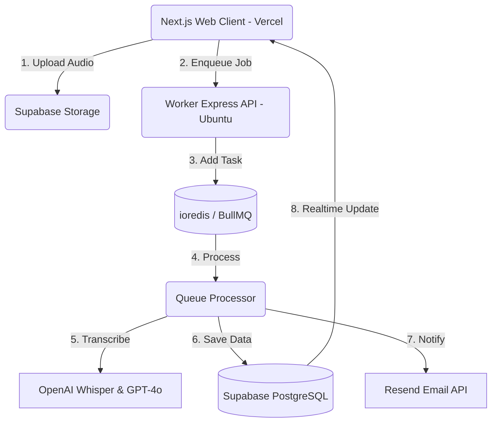

<div align="center">

<br />


<br /><br />

```
███╗   ███╗███████╗███████╗████████╗███╗   ███╗██╗███╗   ██╗██████╗
████╗ ████║██╔════╝██╔════╝╚══██╔══╝████╗ ████║██║████╗  ██║██╔══██╗
██╔████╔██║█████╗  █████╗     ██║   ██╔████╔██║██║██╔██╗ ██║██║  ██║
██║╚██╔╝██║██╔══╝  ██╔══╝     ██║   ██║╚██╔╝██║██║██║╚██╗██║██║  ██║
██║ ╚═╝ ██║███████╗███████╗   ██║   ██║ ╚═╝ ██║██║██║ ╚████║██████╔╝
╚═╝     ╚═╝╚══════╝╚══════╝   ╚═╝   ╚═╝     ╚═╝╚═╝╚═╝  ╚═══╝╚═════╝
```

### **MeetMind** — Yapay Zeka Destekli Toplantı Asistanı & Transkripsiyon

**Ses kayıtlarını saniyeler içinde yazıya dök** · Toplantı özetleri · Aksiyon takibi · Katılımcılara otomatik e-posta.

[🚀 Canlı Demo](https://meetmind-ebon.vercel.app) · [✉️ Resend API](https://resend.com) · [💳 Lemon Squeezy](https://lemonsqueezy.com) · [☁️ Vercel](https://vercel.com)

</div>

---

## ✦ Genel Bakış

**MeetMind**, toplantı kayıtlarınızı (ses/video) saniyeler içinde yüksek doğrulukla yazıya döken, ana kararları özetleyen, toplantı aksiyon maddelerini (görevleri) ilgili kişilere atayan ve katılımcılara otomatik takip e-postası gönderen **bütünleşik bir yapay zeka toplantı asistanıdır**.

Proje, modern ve yüksek performanslı bir monorepo yapısı (Turborepo) ile tasarlanmış olup Next.js tabanlı frontend arayüzü **Vercel** üzerinde, arka plan işlemci servisi (Express + BullMQ + Redis) ise **Ubuntu/Docker** altyapısında çalışmaktadır.

<div align="center">

</div>

---

## ⚡ Öne Çıkan Özellikler

| Özellik | Açıklama |
|--------|----------|
| 🎙️ **Otomatik Transkripsiyon** | OpenAI Whisper altyapısıyla Türkçe ve İngilizce dillerinde %95+ doğruluk oranı. |
| 📊 **Akıllı Karar & Özet** | GPT-4o entegrasyonuyla toplantı özeti, alınan kararlar ve aksiyon listesi oluşturma. |
| ✅ **Aksiyon Maddesi Takibi** | Görevleri önceliklendirip (Düşük, Orta, Yüksek, Acil) kişilere atama ve durum takibi yapma. |
| ✉️ **Otomatik Takip E-postası** | Resend entegrasyonuyla tek tıkla tüm katılımcılara toplantı çıktılarını e-posta ile ulaştırma. |
| 💳 **Abonelik & Ödeme** | Lemon Squeezy entegrasyonu ile Free, Pro ve Team planları için dinamik ödeme altyapısı. |
| 🌍 **Çok Dilli Destek** | `next-intl` altyapısı ile tam kapsamlı Türkçe ve İngilizce yerelleştirme (i18n). |
| 🔔 **Gerçek Zamanlı Güncelleme**| Supabase Realtime ile veritabanı güncellemelerinin anlık olarak arayüze yansıması. |
| 📱 **Mobil Öncelikli Tasarım** | Mobil cihazlarda %100 uyumlu off-canvas sidebar, overlay ve optimize edilmiş performans. |

<div align="center">

</div>

---

## 🗂️ Veri Akışı ve Mimari

Tüm ses işleme, transkripsiyon ve analiz işlemleri arka plan kuyruğu (BullMQ + Redis) vasıtasıyla asenkron şekilde yürütülür ve kullanıcılara Supabase Realtime üzerinden anlık bildirim gönderilir.



1. **Ses Yükleme:** Kullanıcı tarayıcı üzerinden ses dosyasını Supabase Storage'a yükler.
2. **Kuyruk Kaydı:** Web uygulaması, API vasıtasıyla Worker API'ye yeni bir iş (job) ekler.
3. **Redis & BullMQ:** İşlem kuyruğuna alınan ses dosyaları sırasıyla işlenir.
4. **Yapay Zeka Analizleri:** OpenAI Whisper ses dosyasını yazıya döker; GPT-4o özetler ve aksiyon maddelerini çıkarır.
5. **Kayıt ve Bilgilendirme:** Çıktılar Supabase PostgreSQL veritabanına kaydedilir ve Resend ile katılımcılara e-posta gönderilir.
6. **Realtime Senkronizasyon:** Değişiklikler Supabase Realtime kanalıyla arayüze anında yansır.

---

## 📊 Entegrasyon Kapsamı

> MeetMind, uçtan uca toplantı yönetimi için 4 büyük API ile entegre çalışır.

| Entegrasyon | Ne için kullanılır | Teknoloji / SDK |
|-------------|--------------------|-----------------|
| **Supabase** | Auth, PostgreSQL Veritabanı, Realtime veri güncelleme ve Ses Depolama (Storage) | `@supabase/supabase-js`, `@supabase/ssr` |
| **OpenAI** | Whisper-1 ile ses transkripsiyonu ve GPT-4o ile akıllı özet/aksiyon madde analizi | `openai` resmi Node.js SDK |
| **Resend** | Katılımcılara otomatik toplantı özeti ve aksiyon e-postaları gönderimi | `resend` resmi API |
| **Lemon Squeezy** | Premium planlar, abonelik yönetimi ve faturalandırma işlemleri | `lemon-squeezy` SDK |

---

## 🛠️ Teknoloji Yığını

```
Monorepo Yönetimi →  Turborepo (pnpm/npm)
Web Arayüzü       →  Next.js 14.2 (App Router) · React 18 · TypeScript · Zustand
Arka Plan Worker   →  Node.js · Express · BullMQ · ioredis
Stil & Animasyon   →  Tailwind CSS v3 · Framer Motion · Geist Display & Mono yazı tipleri
Veritabanı         →  Supabase PostgreSQL · Realtime · Storage
Yerelleştirme      →  next-intl (TR / EN)
Dağıtım (Deploy)   →  Vercel (Frontend) · Docker & Compose (Worker / Redis)
```

---

## 📐 Proje Yapısı

```
MeetMind/
├── apps/
│   ├── web/                 # Next.js 14 Web Arayüzü (Vercel)
│   │   ├── app/             # API rotaları, locale sayfaları ve yerelleştirilmiş sayfalar
│   │   ├── components/      # layout (header, sidebar, nav), meetings, ui bileşenleri
│   │   ├── stores/          # global durum yönetimi (Zustand ui-store, vb.)
│   │   ├── hooks/           # custom React hook'ları
│   │   ├── lib/             # supabase, navigation ve utils helpers
│   │   └── tailwind.config.ts # renk paleti ve premium animasyon tanımları
│   └── worker/              # Arka plan ses/AI işleme servisi (Docker/Ubuntu)
│       ├── src/
│       │   ├── processors/  # transkripsiyon ve özet (Whisper, GPT-4o) işleyicileri
│       │   ├── queues/      # BullMQ kuyruk yapılandırmaları
│       │   └── routes/      # Express API yönlendirmeleri
├── docker/                  # Worker & Redis docker-compose dosyaları
├── supabase/                # Supabase veritabanı şemaları, migration'lar ve RLS politikaları
├── assets/                  # Ekran görüntüleri ve statik görseller
└── package.json             # Monorepo bağımlılık tanımları
```

---

## 🚀 Kurulum ve Başlangıç

### Gereksinimler
- Node.js `>= 20`
- Docker & Docker Compose
- Supabase, OpenAI, Resend ve Lemon Squeezy hesapları / API anahtarları

### 1. Bağımlılıkların Yüklenmesi
Monorepo yapısındaki tüm bağımlılıkları yüklemek için kök dizinde çalıştırın:
```bash
npm install
```

### 2. Ortam Değişkenleri
Kök dizindeki `.env.example` dosyasını `.env` olarak kopyalayarak oluşturun ve gerekli değişkenleri girin:
- `DATABASE_URL` (Supabase Postgres)
- `NEXT_PUBLIC_SUPABASE_URL` & `NEXT_PUBLIC_SUPABASE_ANON_KEY`
- `OPENAI_API_KEY`
- `RESEND_API_KEY`
- `LEMON_SQUEEZY_API_KEY`

### 3. Veritabanı Şemalarının Yüklenmesi
Supabase CLI aracılığıyla yerel veya uzak veritabanına şemaları gönderin:
```bash
# Supabase oturumu açın
npx supabase login

# Projenizi bağlayın
npx supabase link --project-ref <supabase-project-id>

# Veritabanını güncelleyin
npx supabase db push
```

### 4. Geliştirme Ortamını Başlatma
Frontend arayüzünü ve arka plan worker servisini yerel ortamda çalıştırmak için:
```bash
npm run dev
```
- **Web Arayüzü:** `http://localhost:3000`
- **Worker API:** `http://localhost:3002`

### 5. Docker ile Worker Çalıştırma
Üretim ortamında (production) worker ve Redis'i Docker üzerinde başlatmak için:
```bash
docker compose -f docker/docker-compose.yml build
docker compose -f docker/docker-compose.yml up -d
```

---

<div align="center">

MeetMind, verimli toplantılar için ❤️ ile tasarlandı · **[kutluhangil](https://github.com/kutluhangil)**

<br />

*Beğendiyseniz projeye bir ⭐ bırakmayı unutmayın.*

</div>
